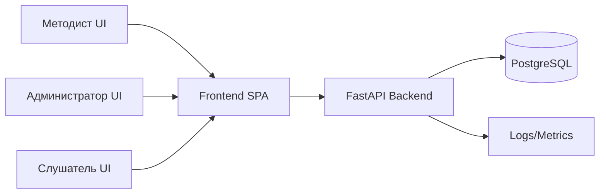

# Карта проекта LMS (MVP)

## 1. Цель MVP
Собрать локально и подготовить к деплою LMS без авторизации, где:
- Методист создаёт программу обучения, модули и уроки.
- Администратор создаёт группу, привязывает программу и зачисляет слушателей.
- Слушатель видит уроки строго по порядку и отмечает прохождение.
- Система хранит прогресс и показывает таблицу прогресса по группе.

## 2. Роли и зона ответственности
- Слушатель: просмотр списка уроков, прохождение уроков по порядку, фиксация статуса.
- Преподаватель: в MVP доступ только к просмотру прогресса (без отдельного UI).
- Куратор: в MVP доступ только к просмотру прогресса и состава группы (без отдельного UI).
- Методист: создание и наполнение программы.
- Администратор: управление группами и зачислением.

## 3. Выбранный стек и языки
- Backend: Python 3.12, FastAPI, SQLAlchemy 2, Pydantic, Alembic.
- Frontend: TypeScript, React, Vite, React Query, React Hook Form, Zod.
- База данных: PostgreSQL 16 (локально через Docker), SQLite как fallback для быстрых тестов.
- Тестирование: Pytest (backend), Vitest + Testing Library (frontend), Playwright (E2E), k6 (нагрузка).
- Инфраструктура: Docker Compose (local), Nginx + Uvicorn/Gunicorn + PostgreSQL (server).
- CI/CD: GitHub Actions (lint/test/load-smoke).

## 4. Контекстная схема


## 5. Функциональная карта модулей
- Модуль A: Управление программами
- Модуль B: Управление модулями и уроками
- Модуль C: Управление группами и зачислением
- Модуль D: Траектория слушателя и прогресс
- Модуль E: Отчёт по прогрессу группы

## 6. Поток данных (core)
1. Методист создаёт `Program`.
2. Методист добавляет `Module` с порядком `order_index`.
3. Методист добавляет `Lesson` с типом `video | text | test` и `order_index`.
4. Администратор создаёт `Group` и связывает её с `Program`.
5. Администратор зачисляет `Student` в `Group` (`Enrollment`).
6. Слушатель получает упорядоченный список уроков.
7. При завершении урока сохраняется `LessonProgress`.
8. API считает агрегированный прогресс (% и completed/total) для таблиц.

## 7. Структура репозитория
```text
LMS/
  backend/
    app/
      api/
      core/
      db/
      models/
      schemas/
      services/
    tests/
  frontend/
    src/
      pages/
      components/
      api/
      types/
      hooks/
    tests/
  tests/
    e2e/
    load/
  docs/
```

## 8. Этапы реализации
1. Архитектура + ТЗ + API контракт.
2. Backend MVP + unit/integration tests.
3. Frontend MVP + component tests.
4. E2E сценарии + нагрузочные сценарии.
5. Локальный запуск в Docker Compose.
6. Подготовка production-конфига и деплой на сервер.

## 9. Критерии готовности MVP
- Программа/модули/уроки создаются из UI-формы.
- Группа создаётся и наполняется слушателями.
- Слушатель видит только следующий доступный урок, порядок соблюдается.
- Таблица прогресса по группе отображает актуальные данные.
- Все автотесты зелёные; load-smoke без деградации SLA.
